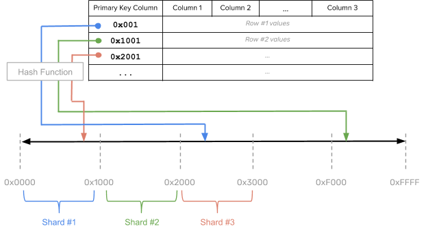

# Database sharding approaches 

## Hash sharding
---------------------------
With (consistent) hash sharding, data is evenly and randomly distributed across shards using a partitioning algorithm. Each row of the table is placed into a shard determined by computing a consistent hash on the partition column values of that row. This is shown in the figure below.

